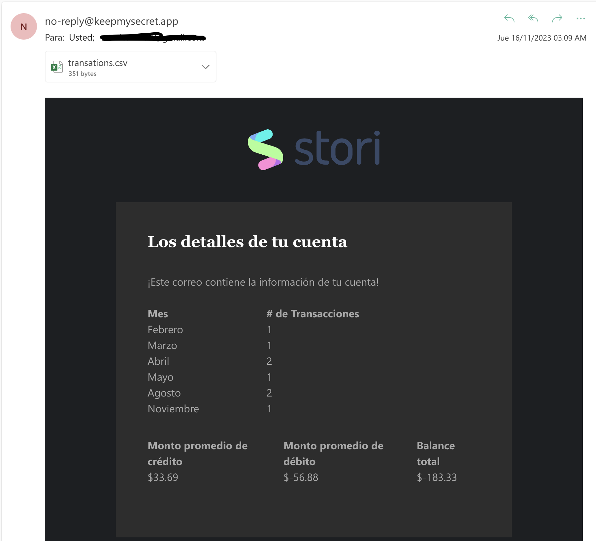

# Stori Challenge

This is the solution for the challenge

## Consider

You must have installed:

- Docker
- Python 3.x.x

## How to test?

- Clone the repository
- Open your terminal and go to project root
- Run `make run_demo` This will start a docker container. If image is not available this command will build it
- Go to [swagger page](http://localhost:8000/swagger/index.html#/transaction_analyzer/post_analyze)
- Enjoy!

You need to consider that this will not send any email because it is mocked. AWS Lambda call will send an email.

## How to call the AWS Lambda function

I deployed this to be used as Lambda function. I sent needed AWS Credential as exported environment variables to be able to call it.

For this you:

- Must export AWS Credentials I sent to Alfonso (this was for security. After 2 days I will delete this credentials)
- Start a new venv running `python -m venv venv`
- Start venv `source venv/bin/activate`
- Run `pip3 install -r requirements.txt`
- Run `python scripts/call_lambda.py <email>`

This `<email>` is one you want to receive the email with account data

## What did I use?

I have worked on a go projects template that I use for all my projects. Besides I wanted to use Turso for database.

In other hand for email I have a registered domain in Mailgun. This is keepmysecret.app.

## Images

Email received

